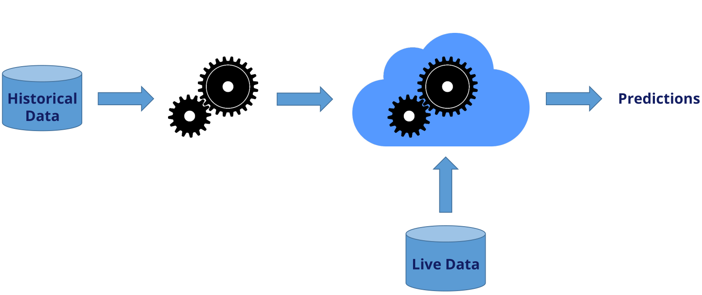
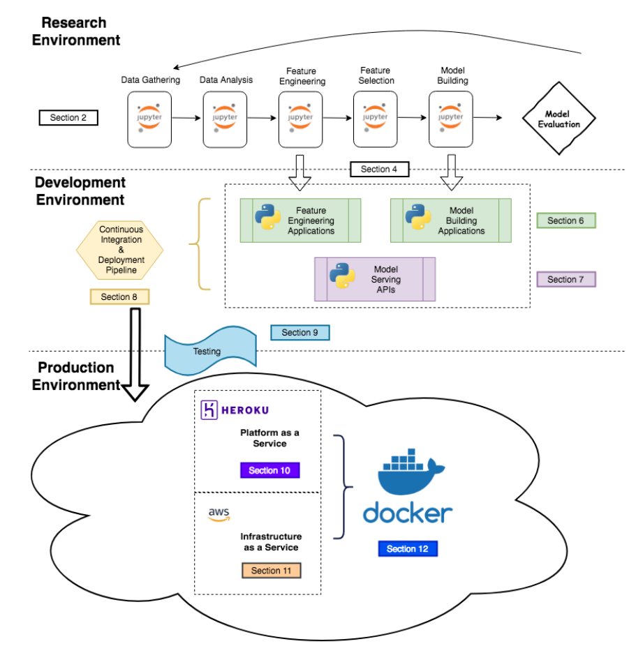

# Deployment of Machine Learning Models
*Learn how to put your machine learning models live and start getting true value from your machine learning models.*

 

- [Deployment of Machine Learning Models](#deployment-of-machine-learning-models)
  - [## Course objectives](#-course-objectives)
  - [## What is model deployment](#-what-is-model-deployment)
  - [## Topics covered](#-topics-covered)
  - [Quick links](#quick-links)

 

This repo contains my notes and code on the awesome course [Deployment of Machine Learning Models](https://www.udemy.com/course/deployment-of-machine-learning-models) by Soledad Galli & Christopher Samiullah @ Udemy.

 

## Course objectives
---
After this course you should

1. Be able to take machine learning models from research stage to a fully integrated API.
2. Be familiar with various coding best practices.
3. Feel comfortable to deploy any machine learning model in various infrastructures.

 

## What is model deployment
---

 

    
     
    <b>Figure. </b> ML models in production.
    

 

- No machine learning model brings true value until it is fully integrated and can be used to score real data. So model deployment is the most important and yet most difficult part of any typical machine learning pipeline.   
- Model deployment requires coordination between data scientists, I.T. teams and their ops software developers, and business professionals to make sure the model works reliably in their organization's production environment.   
- This represents a major challenge. For example, there is often a discrepancy between the programming language in which the machine learning model is written and the languages your production system can understand and recoding the model can extend the project timeline by weeks or months. In order to get the most value out of the machine, it is important to deploy them into production as seamlessly as possible so the business can start using them to make practical decisions.   

 

## Topics covered
---
 

- Entire ML life cycle
- Research phase
- Transform research code into production code + best practices
- Create an API and make API calls
- Testing to make sure production models corroborate research models given same data
- Continuous Integration (CI)
- Various deployment solutions, e.g. PaaS, IaaS
- Docker for reproducibility and robustness

 

    
     
    <b>Figure. </b> Course sections dealing with the phases of model deployment. 
    

 

 

## Quick links

---

 

**Blogs, Tutorials, and Talks**

- [The Machine Learning Reproducibility Crisis](https://petewarden.com/2018/03/19/the-machine-learning-reproducibility-crisis/)
- [Reproducible Machine Learning](http://www.rctatman.com/files/Tatman_2018_ReproducibleML.pdf)
- [Introducing FBLearner Flow: Facebook’s AI backbone](https://engineering.fb.com/2016/05/09/core-data/introducing-fblearner-flow-facebook-s-ai-backbone/)
- [System Architectures for Personalization and Recommendation](https://netflixtechblog.com/system-architectures-for-personalization-and-recommendation-e081aa94b5d8)
- [Meet Michelangelo: Uber’s Machine Learning Platform](https://eng.uber.com/michelangelo-machine-learning-platform/)
- [DSF Mainstage Day 2019 - Building and Deploying Reproducible ML Pipelines](https://www.youtube.com/watch?v=7jKTofl2vmM&ab_channel=DataScienceFestival)
- [YAML Tutorial | Using YAML With Python | PyYAML](https://dev.to/developertharun/yaml-tutorial-using-yaml-with-python-pyyaml-443d)
- [Soledad Galli - Machine Learning in Financial Credit Risk Assessment](https://www.youtube.com/watch?v=KHGGlozsRtA&ab_channel=PyData)

 

**Papers**

- [KDD Cup 2009. Knowledge Discovery. Challenges in Machine Learning, Volume 3](http://www.mtome.com/Publications/CiML/CiML-v3-book.pdf)
- [Sugimura & Hartl. Building a Reproducible Machine Learning Pipeline](https://arxiv.org/ftp/arxiv/papers/1810/1810.04570.pdf)
- [Li Erran et. al. Scaling Machine Learning as a Service](http://proceedings.mlr.press/v67/li17a/li17a.pdf)
- [Ghanta et. al. A Systems Perspective to Reproducibility in Production Machine Learning Domain](https://openreview.net/pdf?id=Byl4vavigX)
- [Hidden Technical Debt in Machine Learning Systems](https://papers.nips.cc/paper/2015/file/86df7dcfd896fcaf2674f757a2463eba-Paper.pdf)
- [TFX: A TensorFlow-Based Production-Scale Machine Learning Platform](https://research.google/pubs/pub46484/)
- [What’s your ML Test Score? A rubric for ML production systems](https://storage.googleapis.com/pub-tools-public-publication-data/pdf/45742.pdf)

 
